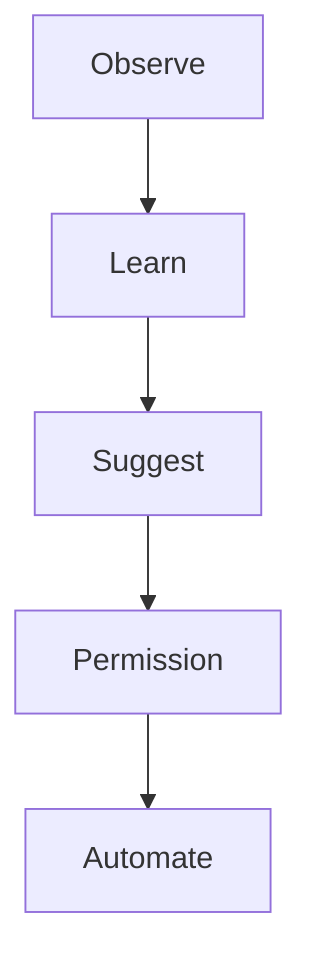

# Documentation Standards

| Field | Value |
|-------|-------|
| **Purpose** | Define how all Workspace documentation is written, structured, maintained, and reviewed |
| **Owner** | Lead Software Engineer |
| **Dependencies** | [Engineering Principles](ENGINEERING-PRINCIPLES.md), [Governance Model](../00-Constitution/GOVERNANCE.md) |
| **Update Process** | Update when documentation tooling or conventions change. |

---

## 1. Documentation Philosophy

Documentation is a first-class deliverable, not an afterthought. In Phase 0, documentation **is** the deliverable. At scale, documentation is how future engineers and AI contributors understand intent without reading every line of code.

---

## 2. Document Metadata

Every document in `docs/` must include this metadata block immediately after the title:

```markdown
| Field | Value |
|-------|-------|
| **Purpose** | One sentence describing why this document exists |
| **Owner** | Role responsible for accuracy and updates |
| **Dependencies** | Links to documents this depends on |
| **Update Process** | How and when this document should be updated |
```

---

## 3. Document Structure

### 3.1 Required Sections

1. **Title** — Clear, descriptive (H1)
2. **Metadata** — Purpose, Owner, Dependencies, Update Process
3. **Body** — Numbered sections with H2/H3 hierarchy
4. **Related Documents** — Links to related docs (at bottom)

### 3.2 Writing Style

- Use clear, direct language
- Prefer active voice
- One idea per paragraph
- Use tables for structured comparisons
- Use diagrams (ASCII or Mermaid) for flows and architecture
- Define acronyms on first use
- Write for an engineer who has never seen the project

### 3.3 What to Document

| Document Type | Contents |
|---------------|----------|
| Principles | Values, rules, constraints — the "why" |
| Vision | Goals, user experience, product direction |
| Architecture | System structure, boundaries, data flow |
| Standards | Conventions, checklists, processes |
| Decisions | Options considered, choice made, rationale |
| Roadmap | Phases, milestones, gate criteria |

### 3.4 What Not to Document Here

- Implementation details that belong in code comments or module READMEs
- Temporary notes or brainstorming (use issues or sprint notes)
- Duplicate information — link instead of copy

---

## 4. Directory Organisation

```
docs/
├── 00-Constitution/     # Non-negotiable rules
├── 01-Product/          # What and why
├── 02-Architecture/     # System design
├── 03-Engineering/      # How we build
├── 04-UX/               # Interaction design principles
├── 05-AI/               # AI behaviour and governance
├── 06-Plugins/          # Extension platform
├── 07-Security/         # Security model
├── 08-Roadmap/          # Timeline and phases
├── 09-Decisions/        # Decision log and open questions
├── 10-Sprints/          # Sprint planning structure
└── README.md            # Index with descriptions
```

Numbered prefixes enforce hierarchy. Do not renumber without Decision Log entry.

---

## 5. Naming Conventions

- File names: `UPPER-KEBAB-CASE.md`
- Descriptive and specific: `AI-PRINCIPLES.md` not `AI.md`
- One topic per file
- Index files named `README.md`

---

## 6. Cross-Referencing

- Link to other documents using relative paths: `[Product Vision](../01-Product/PRODUCT-VISION.md)`
- Every document lists Related Documents at the bottom
- When a document is referenced by another, ensure the link is bidirectional where sensible
- Broken links are bugs — fix them in the same PR that causes the break

---

## 7. Diagrams

### ASCII Diagrams

Use for simple flows and layer diagrams. Keep them readable in plain text.

### Mermaid Diagrams

Use for complex flows, sequence diagrams, and state machines. Supported natively on GitHub.

```markdown

```

---

## 8. Review Process

Documentation changes follow the same PR process as code:

- PR describes what changed and why
- Reviewer checks accuracy, completeness, and cross-references
- Material changes to principles or constitution require domain owner approval
- Typo fixes and clarifications can be approved by any team member

---

## 9. Maintenance

| Activity | Frequency |
|----------|-----------|
| Broken link check | Each PR (manual); automated when CI configured |
| Stale document review | Quarterly |
| Index (`docs/README.md`) update | When documents are added or removed |
| Open Questions triage | Weekly during active development |

A document is **stale** if it has not been reviewed within two roadmap phases of its last update.

---

## 10. Module-Level Documentation (Future)

When implementation begins, each package in `packages/` must include:

- `README.md` — Purpose, public API summary, usage examples
- API documentation for exported interfaces
- Architecture notes for non-obvious design choices

Module docs follow these standards but live alongside code, not in `docs/`.

---

## Related Documents

- [Engineering Principles](ENGINEERING-PRINCIPLES.md)
- [Repository Standards](REPOSITORY-STANDARDS.md)
- [docs/README.md](../README.md)
