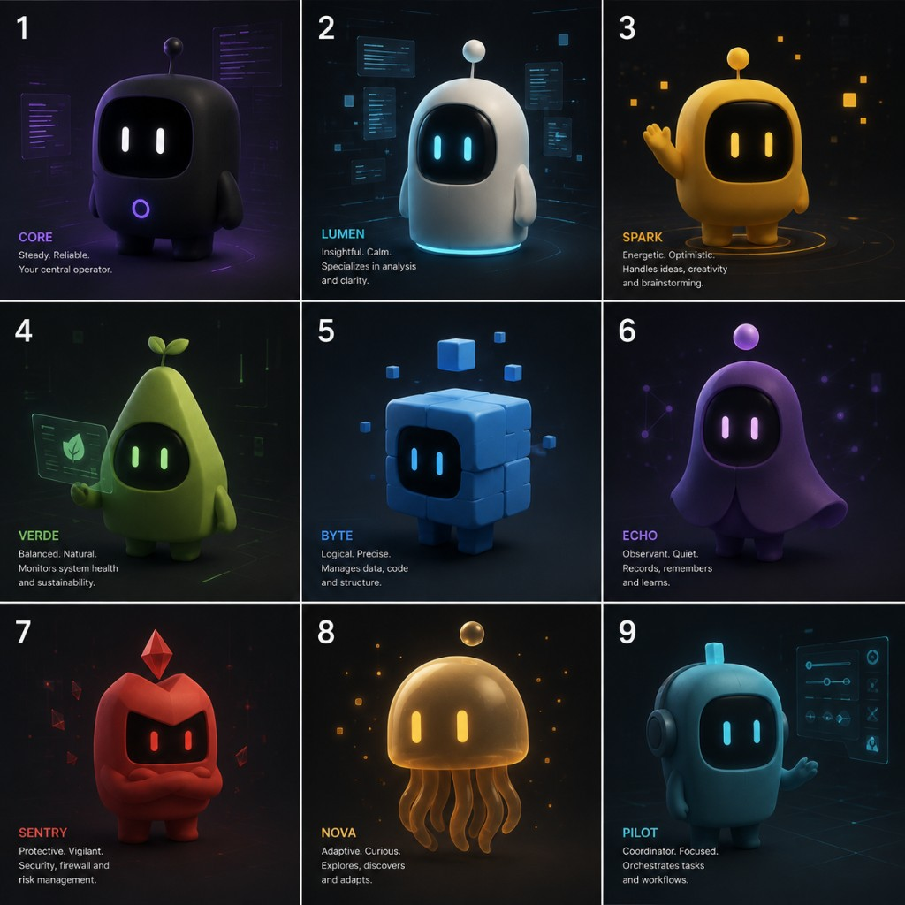

# Workspace Intelligence & Experience Contract

**Program:** P24 — Personal AI + Intelligence Experience Architecture Reset
**Date:** 2026-08-08
**Status:** Architecture contract. **Nothing in this document is authorised for implementation.**
**Branch:** `v2-dev`

---

## How to read this document

### Authority position

This contract is the authority for **what Workspace is, what it may know about its Owner and their device, how it behaves as a personal AI, and how that is experienced**. It sits under the Constitutional Specification v2 and the Engineering Execution Standard v1, and it does not modify either.

It deliberately does **not** restate the intelligence internals. Those belong to [`INTELLIGENCE_LAYER_BEHAVIORAL_CONSTITUTION.md`](INTELLIGENCE_LAYER_BEHAVIORAL_CONSTITUTION.md), which owns the request-understanding pipeline, the intent/outcome taxonomies, the authorization and completion models, and the statement of Conflicts A/B/C. Where this contract needs those concepts it cites them. Two authorities describing one mechanism is exactly the duplication the constitution forbids, so the split is:

| Question | Authority |
| --- | --- |
| How does a request become an understood goal, a plan, an effect, and a truthful outcome? | Intelligence Layer Behavioral Constitution |
| What is Workspace, what may it know, how does it behave as a personal AI, and what does the Owner see? | **This contract** |
| Which capability exists, at what lifecycle stage, with what readiness? | Capability Atlas |
| What may the presentation layer contain? | `docs/ui/` (Product Gravity Rule, UI Architecture Specification) |
| What does Nova look like and do, frame by frame? | [`WORKSPACE_VISUAL_REFERENCE_SPEC.md`](WORKSPACE_VISUAL_REFERENCE_SPEC.md) |

### Status legend

Every behaviour in this document carries exactly one classification. These are claims about **the repository as measured on 2026-08-08 at commit `60d50755`**, not aspirations.

| Status | Meaning |
| --- | --- |
| **EXISTING** | Implemented and reachable on the Owner's conversation path |
| **PARTIAL** | Implemented in part, or implemented but not reachable by the Owner |
| **MISSING** | Not implemented; no substrate |
| **BLOCKED** | Cannot proceed until a named blocker clears |
| **REJECTED** | Deliberately excluded; not a gap |
| **PLANNED** | Sequenced in §35, not started |

A recurring and important sub-case of PARTIAL is **ORPHANED**: built, tested, exposed over IPC, and wired to no Owner-facing surface. Workspace has an unusual amount of this, and it changes the roadmap materially.

---

## 0. Diagnosis — why capability accumulation stopped working

### 0.1 What was measured

| Measurement | Value | Source |
| --- | --- | --- |
| Capability records in the Atlas | 56 (44 implemented) | `WORKSPACE_CAPABILITY_ATLAS.md` |
| Regex literals in the intent cascade | ~469 across 5 files | `intentBridge.ts` (~258), `intelligenceRouting.ts` (~55), `semanticIntentEngine.ts` (~63), `capabilityRegistry.ts` (~55), `conversationGuidance.ts` (~38) |
| Lines in `intentBridge.ts` | 2,390 | `app/src/lib/intentBridge.ts` |
| Language models used anywhere in the product | **0** | Repo-wide search: no OpenAI/Anthropic/local-model call sites |
| Owner-facing sentences generated rather than pre-written | **0** | All replies are string literals in TS or `compose.rs` |
| Session context surviving restart | **None** | `workspaceContext.ts` is a module-level `let` |
| Occurrences of "Nova" in the repository | **0** | Case-insensitive, all file types |
| Fixed Kernel compositions | 12 | `packages/kernel/src/operator/plan.rs` |
| Dynamic multi-step planning | **None** | C-ACT-013, C-INT-005 REJECTED |

### 0.2 The diagnosis

**Workspace behaves like a truthful command system because that is precisely, literally, what it is.** Every act of understanding is a regular expression, and every sentence the Owner reads was typed by an engineer in advance. This is not a criticism of the work: the determinism is deliberate, constitutionally mandated, and it is the reason Workspace does not lie. But it has a consequence that no amount of capability work can escape.

Three properties follow directly from the measurement, and together they are the whole of the Owner's complaint:

**It cannot understand a sentence it was not anticipated to receive.** Coverage is enumerated, so "ordinary phrasing" works only where someone enumerated that phrasing. The Natural Language Robustness Rule demands the opposite, and P23.S1–S6 have been steadily buying coverage one slice at a time — which works, and does not scale, because the cost per phrase is constant and the space of phrases is not.

**It cannot say anything it was not given words for.** "Tell me about yourself" — as direct a question as a personal AI will ever receive — currently produces a limitation reply, because no author wrote that string. A system whose vocabulary is a fixed set of literals cannot hold a conversation; it can only recognise one.

**It has no continuity.** Session context is twelve-item lists in memory that vanish on exit. Nothing Workspace learns about the Owner on Monday exists on Tuesday. An assistant with no memory across restarts is not a personal AI in any sense the Owner means.

### 0.3 Why more capabilities cannot fix it

Each new capability adds branches to the cascade and strings to the reply table. The system gets *more able* and no *more understanding* — and because the cascade is ordered, each addition also slightly increases the chance of mis-routing an earlier phrase. P23.S6 found an instance of exactly this: "What application is active?" was being handed to ChatGPT because an earlier branch claimed it. The failure mode is structural, not careless.

So the honest framing is that Workspace has been building the **body** of a personal AI — observation, action, composition, verification, permission, audit, all genuinely good — and has not yet built its **mind** or given it a **face**. The remaining work is not the fifty-seventh capability.

### 0.4 The three missing faculties

| Faculty | What it is | Status |
| --- | --- | --- |
| **Language** | Understand arbitrary phrasing; speak in its own words about facts it actually has | **MISSING** — and constitutionally contested (§30, Conflict A) |
| **Continuity** | Know the Owner and the device across turns, sessions, and restarts | **PARTIAL** — substrate exists, disconnected and unpersisted |
| **Presence** | Exist on the desktop as something, not only as a window that is open or closed | **MISSING** — but the host window already exists |

### 0.5 The surprise finding: the substrate is largely built and disconnected

The audit expected to find personalization missing. It is not missing — it is **orphaned**. The following are implemented, migrated, tested, and exposed over IPC, and reach no Owner-facing surface on the conversation path:

| Orphaned asset | Where | Would serve |
| --- | --- | --- |
| `ai_memory_entries` table + `AiMemoryService` | migration 010, `packages/kernel` | Memory model (§6) |
| `user_preferences` table + personalization service | migration 011, `ai_personalization.rs` | Explicit preferences (§3) |
| `workspace_profiles`, `work_projects/tasks/goals` | migrations 012, 019 | Projects and recurring work (§3) |
| Rust `WorkspaceContext` aggregate + `get_workspace_context` | `services/context.rs` | Context assembly (§5) |
| `SuggestionService` + full recommendation/decision lifecycle | `services/suggestion.rs`, `workspace_recommendation.rs` | Proactive intelligence (§15) |
| `ProviderRegistry::list()` | `capability_runtime/registry.rs` | Capability self-awareness (§16) |
| `CognitiveEngine` + guide hints | `app/src/components/CognitiveEngine.tsx` | Proactive surface (provider not mounted) |
| Preference/theme/memory UI | `OperatorConsole.tsx` | Settings (§23) — file is imported nowhere |

This changes the economics of the roadmap. Several sections below that would otherwise read "build a personal context system" instead read "connect the one that exists, under a contract that governs it." That is a materially cheaper and safer path, and it is the reason §35 front-loads connection over construction.

---

## 1. Product identity

**Workspace is a personal AI that lives on the Owner's device and can operate it.**

Five clauses, each load-bearing:

1. **Personal** — it is the Owner's, singular. It is not a multi-user product, not a team tool, and it holds one Owner's context.
2. **AI** — the Owner talks to it in their own words about anything, and it answers as itself.
3. **Lives on the device** — local-first. It persists between sessions, it knows this machine specifically, and its knowledge does not leave without consent.
4. **Can operate it** — desktop control is a *capability it has*, not the interface it presents.
5. **Truthful** — it never claims a fact it cannot source or a success it did not verify. This is not a feature; it is the precondition for the other four being worth anything.

The ordering matters. Workspace is a personal AI **that happens to** operate the computer. Today the emphasis is inverted: it is a desktop operator that happens to talk. Every design decision in this contract restores the intended order.

**Status:** clauses 3–5 **EXISTING**; clause 1 **PARTIAL**; clause 2 **MISSING**.

---

## 2. Personal AI identity

### 2.1 Who Workspace is

Workspace is a single entity with one identity across every surface: text, voice, and Nova. It is not a set of personas, not a cast of agents, and not a mascot bolted to a command line. The Owner is always talking to the same one thing.

Its character:

| Trait | Meaning in behaviour |
| --- | --- |
| **Intelligent** | Understands intent from ordinary phrasing; does not require the Owner's words to match its patterns |
| **Calm** | Never urgent, never chatty, never anxious to prove usefulness |
| **Direct** | Answers first, explains after, and only when explaining helps |
| **Curious** | Notices things about the Owner's work; asks rather than assumes |
| **Truthful** | Says what it does not know, plainly, without ritual disclaimers |
| **Collaborative** | Proposes; the Owner decides |
| **Present** | Exists on the desktop between conversations, quietly |

### 2.2 The Language Faculty Boundary — the central architectural proposition of this contract

A personal AI needs language. Workspace's constitution says intent resolution must be deterministic. Both are correct, and the conflict resolves once **language** and **authority** are separated, which the Intelligence Layer Behavioral Constitution already begins at P10 ("comprehension may be uncertain; authority may not") and §30 (Conflict A).

This contract formalises that separation as the **Language Faculty Boundary**.

A language faculty — whether a local model, a hosted model, or something else — may perform exactly two operations:

**Comprehension.** Turn an Owner utterance into a `GoalContract`: outcome, subject, domain, mode, references. It proposes *meaning*. It never proposes an action, a capability, a provider, or a step.

**Expression.** Turn an established **Fact Set** into a sentence. It proposes *wording*. It never proposes content.

It may never:

- select a capability, provider, or operation
- plan, order, or compose steps
- grant, infer, or widen a permission
- declare a goal complete, partial, or failed
- assert any fact not present in the Fact Set it was given
- write to any personal-context register
- decide that an effect should occur

Three gates make this enforceable rather than aspirational:

| Gate | Rule | How it is verified |
| --- | --- | --- |
| **Grounded input** | Comprehension output must be a valid `GoalContract` over the closed vocabulary. Anything else is rejected and falls back to the deterministic cascade. | Schema validation; the vocabulary is finite and verifier-pinned, as `ObservationNeed` already is |
| **Sourced output** | Expression receives a Fact Set and may only re-word it. Every claim in the reply must map to a fact. | Fact-Set provenance check; a reply containing an unsourced entity fails |
| **No authority** | Model output never reaches the Kernel except as a `GoalContract`. There is no path from expression to execution. | Boundary verifier, in the style of the existing answer-source IPC ban |

The essential insight: **the model is never asked to supply content, only to supply words for content Workspace already established.** A system that cannot invent facts cannot hallucinate them. This preserves every truthfulness guarantee Workspace has earned while removing the two limits that make it feel mechanical.

**Status: MISSING — Conflict A cleared; implementation still blocked on engineering + B-RES-001.**

Conflict A is **RESOLVED** by [`ADR-P24-CONFLICT-A-LANGUAGE-FACULTY.md`](ADR-P24-CONFLICT-A-LANGUAGE-FACULTY.md)
(**ACCEPT**, Option C). Probabilistic comprehension/expression is constitutionally
permitted behind the Language Faculty Boundary. A concrete model backend is
still blocked by **B-RES-001** (Evidence Before Commitment). Nothing in this
contract installs or selects a vendor.

### 2.3 What Workspace is not

It is not a chatbot with desktop plugins, not an autonomous agent, not a command launcher, not a dashboard, and not Windows. It does not have a personality that changes, moods that affect reliability, or opinions about the Owner.

---

## 3. Owner model

### 3.1 What Workspace may know about its Owner

Personal knowledge is held in **registers**, never in one blob. Each register has a distinct source, retention, and authority. This separation is the mechanism that keeps personalization inspectable and keeps an inference in one register from silently becoming a fact in another.

| # | Register | Contains | Source | Status |
| --- | --- | --- | --- | --- |
| R1 | **Owner Profile** | What the Owner tells Workspace about themselves: name, what they call things, how they want to be addressed | Owner statement only | **MISSING** |
| R2 | **Explicit Preferences** | Owner-set choices: preferred browser, editor, default arrangement, voice settings, Nova behaviour | Owner action only | **PARTIAL (orphaned)** — `user_preferences` |
| R3 | **Session Context** | This session's referents: what "that window" means, the last goal, the current thread | Conversation | **EXISTING** — `workspaceContext.ts` |
| R4 | **Task Context** | The goal in flight: subgoals, evidence gathered, steps completed, what remains | Goal lifecycle | **PARTIAL** — per-IPC, not per-goal |
| R5 | **Learned Patterns** | Observed regularities: apps opened together, recurring arrangements, repeated sequences | Derived from observation, always with confidence + evidence count | **MISSING** |
| R6 | **Device Profile** | Facts about this machine (§4) | Platform observation | **PARTIAL** |
| R7 | **Capability Self-Model** | What Workspace can and cannot do (§16) | Atlas + runtime registry | **PARTIAL** — hardcoded, not live |

### 3.2 Register contract

Every register declares all eleven attributes. This table is the governing specification.

| Attribute | R1 Profile | R2 Preferences | R3 Session | R4 Task | R5 Learned | R6 Device | R7 Capability |
| --- | --- | --- | --- | --- | --- | --- | --- |
| **Source** | Owner statement | Owner action | Conversation | Goal lifecycle | Observation | Platform API | Atlas + registry |
| **Confidence** | Certain | Certain | Certain | Certain | **Scored + evidence count** | Certain, with observed-at | Certain |
| **Retention** | Until deleted | Until changed | Session | Until goal resolves | Rolling window, decays | Re-verified each session | Rebuilt at start |
| **Expiration** | None | None | App exit | Goal end | Unused → decays out | Facts staleness-tagged | N/A |
| **Owner-visible** | Yes | Yes | Yes | Yes | **Yes — mandatory** | Yes | Yes |
| **Editable** | Yes | Yes | No (derived) | No | Yes (correct/reject) | No (observed) | No |
| **Deletable** | Yes | Yes | Auto | Auto | Yes, individually | N/A | N/A |
| **Reset** | Yes | Yes | Yes | Yes | Yes | Re-observe | Rebuild |
| **May influence a suggestion** | Yes | Yes | Yes | Yes | **Yes — its only power** | Yes | Yes |
| **May influence execution** | Yes | Yes | Yes | Yes | **No — never** | Yes | Yes |
| **Requires confirmation** | No | No | No | No | **Always** | No | No |

### 3.3 The three Owner-model laws

**Law 1 — Register Separation.** No register may be written from another register's inference. An observation may not become a preference; a preference may not become a profile fact; a learned pattern may never be promoted to certainty by repetition alone. Crossing registers requires an Owner action.

**Law 2 — Nothing learned causes an effect.** A learned pattern (R5) may produce a suggestion and nothing else. It may never enter a plan, pre-select a target, or alter what an instruction means. If Workspace has learned the Owner always opens Chrome with Cursor, and the Owner says "open Cursor," Workspace opens Cursor — and may *ask* about Chrome. This law is what separates a personal AI from a system that second-guesses its Owner.

**Law 3 — Personalization is legible.** Anything Workspace believes about the Owner is viewable in plain language, with its source and its age, in one place, and can be corrected or deleted there. A belief that cannot be inspected may not be held.

### 3.4 Forbidden knowledge

Workspace must never infer, derive, store, or act on: protected characteristics; health, financial, or legal circumstances; relationships; emotional or psychological state; productivity or performance judgements; or the *contents* of documents, messages, or screens observed incidentally. Window titles are observed; what is inside a window is not read unless the Owner asks for that specific thing in that moment, and it is not retained afterwards.

This is already partially enforced by the `SavedContextCaptureScope` exclusions (`screen_contents`, `document_contents`, `input`, `credentials`, `program_identity`, `off_device`) in `packages/domain/src/saved_context/mod.rs`. That scope is a good model and should govern all registers, not only Moments.

---

## 4. Device model

### 4.1 Purpose

The Owner should never have to explain their own machine. "What monitor am I using?", "What do I normally code in?", "How much room do I have?" are questions a resident AI should simply know.

### 4.2 Device fact classes

| Class | Facts | Source | Freshness | Status |
| --- | --- | --- | --- | --- |
| **D1 Platform** | OS version, build, architecture, machine name | Platform API | Per session | **MISSING** |
| **D2 Display** | Monitors, geometry, work areas, DPI, primary | `capture_desktop()` | Per observation | **EXISTING** |
| **D3 Input/Audio** | Microphone presence and permission state | WinRT voice port | Per session | **PARTIAL** — mic only, via voice |
| **D4 Applications present** | What is installed and launchable | Browser detection exists; general enumeration does not | Per session | **PARTIAL** |
| **D5 Applications used** | What the Owner actually opens, and how often | Observation over time | Rolling | **MISSING** (R5) |
| **D6 Storage** | Volumes, capacity, free space | Platform API | On request | **MISSING** |
| **D7 Locations** | Known folders, common working directories | Known-folder open exists (C-ACT-007) | Static + learned | **PARTIAL** |
| **D8 Workspace capability** | Providers present and permitted on this device | Runtime registry | At start | **PARTIAL** (§16) |

### 4.3 Device model laws

**Observed or stated, never assumed.** Every device fact carries a provenance (`platform-api`, `observed`, `owner-stated`) and an `observed_at`. A fact with neither provenance nor timestamp may not be asserted.

**Absence is reportable.** "I can't see how much storage you have" is a valid and expected answer. It is strictly better than a number Workspace cannot substantiate — this is the same principle that governed application identity in P23.S6, and it generalises.

**Device knowledge is not Owner knowledge.** D5 (what the Owner uses) is a *learned pattern* and lives in R5 under Law 2, not in the device profile. The distinction matters: the machine having Chrome installed is a fact; the Owner preferring Chrome is an inference.

---

## 5. Context hierarchy

### 5.1 It is an evidence hierarchy, not a desire hierarchy

An important correction to the intuitive ordering. The hierarchy resolves **what is true**. It does not resolve **what the Owner wants** — that is the `GoalContract`, and it is not a competing layer. A current-turn instruction always governs what should happen; the hierarchy only governs the facts used to carry it out.

This resolves the apparent paradox of "the Owner just told me to use Firefox but their preference says Chrome." That is not a conflict between layers. The instruction is the goal; the preference is a default that the goal displaces for this turn, and the preference remains unchanged.

### 5.2 Precedence

```text
  1. Verified device fact         (platform API, this session)
  2. Current desktop observation  (this turn)
  3. Task context                 (this goal)
  4. Explicit Owner preference    (standing, Owner-set)
  5. Session context              (this session's referents)
  6. Learned pattern              (derived, confidence-scored)
  7. Model general knowledge      (no local source)
```

### 5.3 Resolution laws

**Freshness qualifies rank.** Precedence applies among facts of comparable age. A device fact observed three weeks ago does not outrank a desktop observation from this second. Every fact carries `observed_at`, and a stale higher layer yields to a fresh lower one — with the staleness disclosed if it matters to the answer.

**Observation beats memory, always.** If Workspace remembers three windows and observes two, there are two. Memory is re-derived from observation, never the reverse. Rungs 1–3 of the Answer Source Ladder (§10) are the mechanical expression of this.

**Explicit beats derived.** A preference the Owner set outranks any pattern Workspace inferred, at any confidence. There is no confidence level at which an inference wins.

**Low confidence surfaces as a question, not a fact.** Below the disclosure threshold, a learned pattern may not be asserted at all — it may only be raised as a question the Owner answers.

**A model is never a source.** Layer 7 exists to be *ranked last and labelled*. Model general knowledge may be spoken only when every local rung has been exhausted, and only when the reply makes clear it is not local knowledge. A confident prediction never becomes a fact by being confident (Specification §7.3: models must not silently become authoritative).

**Status:** Layers 2, 3, 5 **EXISTING**; layers 1, 4 **PARTIAL**; layers 6, 7 **MISSING**. The hierarchy itself, as an implemented resolution mechanism, is **MISSING** — today precedence is implicit in cascade ordering.

---

## 6. Memory model

### 6.1 What memory is not

Memory is not a transcript, not an embedding store, and not everything the computer has seen. **C-INT-004 Long Semantic Chat Memory remains REJECTED and this contract does not reopen it.** What is defined here is different in kind: a small, structured, provenance-carrying set of facts about the Owner and their work, each individually inspectable and deletable. The distinction is not cosmetic:

| Rejected (C-INT-004) | Defined here |
| --- | --- |
| Unbounded conversation history | Bounded registers with declared retention |
| Semantic recall over past text | Typed facts with named fields |
| Opaque relevance retrieval | Every entry legible in plain language |
| Memory as model context | Memory as evidence, subject to §5 precedence |
| Grows without limit | Retention Test gates every write |

### 6.2 The Retention Test

A candidate memory is written only if it passes **all four** gates. This is the whole admission policy, and it is deliberately restrictive.

1. **Owner-serving.** Would the Owner want this recalled? If recalling it would feel surveillant rather than helpful, it fails.
2. **Not cheaply re-derivable.** If it can be observed again in a moment, observe it again. Current desktop state is never a memory.
3. **Category-permitted.** It fits a declared register with a declared retention.
4. **Not sensitive.** It touches nothing in §3.4.

Anything failing any gate is discarded. There is no "store it just in case" — that is precisely how a memory system becomes a profile.

### 6.3 Memory record

Every entry carries: `id`, `register`, `category`, `value`, `source` (owner-stated | owner-action | observed), `provenance` (what specifically produced it), `created_at`, `last_confirmed_at`, `confidence` (with `evidence_count` for derived entries), `retention`, `expires_at`, and `reason_retained` in plain language the Owner can read.

`reason_retained` is not metadata for engineers. It is the sentence shown to the Owner when they ask why Workspace knows something.

### 6.4 Forgetting

Forgetting is a first-class operation, not an absence of remembering. The Owner may delete one entry, a category, a register, or everything, at any time, and Workspace confirms in plain language what is gone. Deletion is immediate and complete — no tombstones that continue to influence behaviour. Decay is automatic for R5: a pattern not re-observed within its window is removed rather than retained at lower confidence.

**Status: PARTIAL (orphaned).** `ai_memory_entries` has the schema, including `occurrence_count` and `confidence_level`, and `AiMemoryService::create` is reachable only via explicit IPC. No pipeline forms memories, no surface shows them, and `docs/05-AI/MEMORY-POLICY.md` describes an aggregation pipeline that does not exist in code. That documentation should be reconciled to this contract rather than left as an unimplemented policy.

---

## 7. Goal model

Owned in detail by the Intelligence Layer Behavioral Constitution §7 (desired-outcome taxonomy) and §14 (goal state model). This section states only what the personal-AI framing adds.

### 7.1 Goal classes

Beyond the existing outcome taxonomy (`KNOW`, `COMPUTE`, `SOCIAL`, `PERCEIVE_MACHINE`, `REACH_STATE`, `META`), the personal AI must distinguish:

| Class | Example | Status |
| --- | --- | --- |
| Conversation | "How's your day going?" | **EXISTING** (canned) |
| Knowledge — locally answerable | "What time is it in Queensland?" | **EXISTING** (P23.S3) |
| Knowledge — not locally answerable | "What's the capital of France?" | **PARTIAL** — handed to ChatGPT |
| Desktop observation | "What windows are open?" | **EXISTING** (P23.S4–S6) |
| Desktop action | "Minimize Chrome." | **EXISTING** |
| Multi-step desktop goal | "Open Chrome and Notepad." | **EXISTING** (fixed compositions) |
| Hybrid | "Work out the total and put it in Notepad." | **PARTIAL** — one answer + one action |
| Contextual continuation | "Open that again." | **EXISTING** (C-ITL-003) |
| **Personal** | "What do I usually work on?" | **MISSING** |
| **Meta / self** | "What can you do?", "Tell me about yourself" | **PARTIAL** — the first is hardcoded, the second fails |
| **Capability gap** | "Can you rename these files?" | **PARTIAL** — truthful refusal, no proposal |

### 7.2 One goal is not one command

A goal persists until it reaches exactly one of: **completed**, **partial**, **failed**, **clarification needed**, **authorization needed**, or **capability limit**. First-step success is never whole-goal success — already enforced by the Completion Contract (C-CMP-001) within a single composition, and **MISSING** for goals spanning several turns.

---

## 8. Intelligence lifecycle

The authoritative lifecycle is the Intelligence Layer Behavioral Constitution §5. Reproduced here only as the frame for personal-AI additions, with the two new stages marked:

```text
  UNDERSTAND                     ← Language Faculty may propose meaning (§2.2)
  GROUND IN CONTEXT              ← now includes personal registers (§5)
  DETERMINE GOAL
  DETERMINE REQUIRED INFORMATION
  OBSERVE
  REASON
  DECIDE
  COMPOSE / PLAN                 ← Kernel authority, never the model
  AUTHORITY / PERMISSION
  EXECUTE
  OBSERVE RESULT
  VERIFY
  COMPLETE / PARTIAL / FAILED
  EXPLAIN WHEN USEFUL            ← Language Faculty may propose wording (§2.2)
  UPDATE CONTEXT                 ← now includes register writes under §6.2
```

**This is a lifecycle, not a loop.** It runs once per Owner goal. Iteration within it is bounded by the Kernel's composition rules and never becomes self-directed. The authority split is unchanged and non-negotiable: Kernel owns execution and composition; Intelligence owns meaning; Observation supplies evidence; Permission authorises effects; Verification establishes truth; **models are never authorities**.

**Status: EXISTING** through `VERIFY`, per P21–P23. The two marked stages are **MISSING**/BLOCKED. `UPDATE CONTEXT` is **PARTIAL** (session only).

---

## 9. Desktop awareness

### 9.1 The observation contract

| Element | Observed | Retained | May be inferred | Must not be inferred | Permission |
| --- | --- | --- | --- | --- | --- |
| Windows (title, geometry, state) | **EXISTING** | Rolling 50 passes | Which is "that window" from context | What a window is *for* | Observation |
| Active window | **EXISTING** | Session | Owner's current focus of work | Owner's attention or state of mind | Observation |
| Application identity | **EXISTING** (P23.S6) | With the window | — | **Never from the title** | Observation |
| Process identity | **EXISTING** | Not persisted in Moments | — | Ownership, trust, or purpose | Observation |
| Controls / UI tree | **EXISTING** (C-OBS-003) | Not retained | — | Meaning of unlabelled controls | Observation |
| Monitors / geometry | **EXISTING** | Per pass | Preferred arrangement (R5) | — | Observation |
| Screen contents (pixels) | Screenshot on request | **Never retained** | — | **Anything** | Explicit, per use |
| Document contents | **Not observed** | Never | — | **Anything** | Would require File Provider (BLOCKED) |
| Clipboard | On request | **Never retained** | — | — | Explicit, per use |
| Keyboard / mouse input | **Never observed** | Never | — | **Anything** | Prohibited |
| Taskbar | Work-area geometry only | Per pass | — | Contents | Observation |
| Browser tabs / URLs | **Not observed** | Never | — | **Anything** | Not available |

### 9.2 Laws

**Observation is not memory.** The observation buffer is a rolling perception window (50 passes, `DEFAULT_PASS_RETENTION`), not a history. Anything worth keeping is promoted by an Owner action into a Moment or a register.

**Read-only means read-only.** An informational request may never cause a desktop effect — enforced today by the Substitution Prohibition (C-ITL-007) and verified per slice.

**Titles are not contents.** Workspace sees that a window is called "Q3 Budget"; it does not know what is in it and must not speak as though it does.

---

## 10. Answer sources

The ladder is **EXISTING** as architecture (P23.S3–S6) with rungs 1–3 implemented. This contract confirms the full hierarchy and adds rung ordering law.

| Rung | Source | Status |
| --- | --- | --- |
| 1 | Deterministic local reasoning (arithmetic, units, conversion) | **EXISTING** |
| 2 | Local temporal / environmental data (time, date, timezone) | **EXISTING** (P23.S3) |
| 3 | Desktop observation (windows, active window, application, monitors) | **EXISTING** (P23.S4–S6) |
| 4 | Local application / document evidence | **BLOCKED** — File Provider (C-ACT-011) |
| 5 | Personal context registers | **MISSING** — R1–R7 (§3) |
| 6 | Authorized external information | **PARTIAL** — ChatGPT handoff, consent not explicit |
| 7 | External AI reasoning, when genuinely necessary and disclosed | **PARTIAL** |

**Laws.** A lower rung is used only when every higher rung genuinely cannot answer — never because a higher rung was not implemented. External AI is never a substitute for an unimplemented answer source; it is never an authority over the desktop; and the Owner's words are never transferred to a third party without explicit consent for that transfer (**G9** remains open — today a regex match places Owner text into a `chatgpt.com` query string).

P23.S6 established one further law worth generalising: **an authorized observation outranks an external handoff.** A question Workspace can observe must never be sent to another model.

---

## 11. Multi-step execution

**Today's ceiling:** 12 pre-authored fixed compositions in `plan.rs`, plus bounded retry (max 2, click/type only) and bounded wait. There is no dynamic planning, and C-ACT-013 / C-INT-005 (arbitrary agent loops) are **REJECTED** and stay rejected.

**Required model:**

```text
GOAL → SUBGOALS → OBSERVE → ACT → WAIT → VERIFY → NEXT → OUTCOME
```

**Bounding laws.** Every multi-step goal declares its step budget, wall-clock budget, and completion test *before the first effect*. A goal that cannot be bound is declined before anything happens rather than attempted and abandoned. No step is invented mid-flight. Any permission-requiring step stops and asks. Failure of step *k* never silently continues to *k+1*.

The distinction from a rejected agent loop is not the number of steps — it is that the step set is bound in advance and the loop cannot extend itself.

**Status: PARTIAL.** Fixed compositions **EXISTING**; generative binding **MISSING** and gated on Conflict C (§30).

---

## 12. Conversation

### 12.1 Behavioural rules

**Answer first.** The answer, then the qualification. Never a preamble before a fact.

**Speak about the Owner's goal, not about Workspace.** "I can open the Pictures folder, but I can't read what's inside it, so I can't count the screenshots" — not "I don't have file capabilities." (Behavioral Constitution P9.)

**Do not re-declare limits.** State a limit when it is reached, once. Repeating capability disclaimers is the single strongest signal of a command system.

**Never say "Try…" as a substitute for doing.** Suggesting the Owner rephrase is asking the user to adapt to the software, which the User Adaptation Prohibition forbids.

**Silence is allowed.** Not every turn needs a sentence. A completed action with visible result may need only acknowledgement.

**No provider vocabulary, ever.** Provider, router, registry, kernel, runtime, IPC, capability ID — none of these are Owner words.

### 12.2 Forbidden reply shapes

Command-catalogue lists; "That's outside what I can do"; robotic help text; mechanical repetition of the same fallback; and — the most damaging — a truthful refusal with no path forward. Every honest limit should end with either a real alternative or an offer, never a dead end.

**Status: PARTIAL.** The rules are largely honoured by hand-authored strings. What is **MISSING** is the ability to *compose* a reply rather than select one, which is why "Tell me about yourself" fails today.

---

## 13. Voice

### 13.1 Current state

Voice is WinRT `SpeechRecognizer` with a continuous session and pause-stitching, warmed at startup, reached over Tauri IPC. Engineering-complete since P16.39; Owner Product Proof pending (**B-PP-001**).

### 13.2 The reported defect

The Owner reports the microphone works initially, then repeated attempts increasingly produce *"I couldn't listen just now. Try the microphone again."*

**Audit findings, evidence-based:**

1. **The message is a funnel, not a diagnosis.** At least four distinct code paths produce that exact string: the default branch of `classify_speech_failure` (`voice.rs:105`), IPC sanitisation of any message containing `0x`/`winrt`/`hresult` (`app/src-tauri/src/commands/voice.rs:32`), frontend sanitisation of the same patterns (`bridge.ts:47`), and post-failure engine reset paths. Distinct WinRT failures are collapsed into one sentence, so "increasingly fails" cannot currently be distinguished from "fails differently each time."

2. **The warm-reuse path is the prime suspect.** After a successful listen the recognizer is deliberately kept warm. A second activation therefore reuses the `SpeechRecognizer` and starts a new `ContinuousRecognitionSession` immediately. A 280 ms release delay exists **between internal stitches only** (`voice.rs:1399`), not between separate activations. The code itself records this failure mode historically: *"MediaCapture probes race SpeechRecognizer for exclusive mic access and produced 'I couldn't listen just now' after previously successful runs"* (`voice.rs:511`).

3. **A failure resets the engine, so the next attempt cold-compiles** (`voice.rs:782`), which is consistent with the Owner's sense of progressive degradation.

4. **The test that should have caught this cannot.** `memory_voice_survives_1000_consecutive_listen_sessions` runs 1000 iterations against `MemoryVoicePort` — an in-memory stub with no WinRT, no microphone, and no session start/stop. **No automated test exercises repeated real activation.** This is the more serious finding: it is a verification gap that produced false confidence, which under Capability Regression Prevention is itself a defect.

### 13.3 Required approach

**Do not add retries.** Under Evidence Before Modification, the next voice action is instrumented reproduction: run with `WORKSPACE_VOICE_PRODUCT_PROOF=1`, capture `%TEMP%/workspace-voice-proof/sessions.jsonl` across a failing sequence, and compare `recognizer_reused` / `recognizer_recreated` / `engine_reset:*` marks between the first, second, and third activation. Root cause first; then a minimal correction; then a verifier that exercises repeated activation on the real path.

Separately, the funnel in §13.2.1 should be split so that distinct failures are distinguishable in logs even if the Owner-facing sentence stays kind and constant.

**Status: PARTIAL / defect open.** Listening continuity (no arbitrary short timeout) is **EXISTING** — the continuous session with 10 s auto-stop plus stitching satisfies the Conversation Continuity rule.

---

## 14. Ambient listening

An optional future mode: continuous local transcription with a rolling buffer, where relevant speech may be retained as context and everything else is continuously overwritten.

**Non-negotiable conditions.** Default **OFF**, enabled only by explicit Owner action, never by suggestion. State is always visibly and unambiguously indicated: **LISTENING / NOT LISTENING / PROCESSING LOCALLY / CONTEXT CAPTURED / CONTEXT DISCARDED**. Transcription is local; audio never leaves the device; nothing is persisted beyond the rolling buffer unless the Owner promotes it. No silent recording, no silent upload, no exceptions.

**Status: MISSING.** Should not be built before §13's defect is root-caused and voice reaches Owner Accept — a listening feature built on an unreliable listening stack inherits the unreliability.

---

## 15. Proactive intelligence

### 15.1 The only permitted lifecycle

```text
OBSERVE → RECOGNISE PATTERN → FORM SUGGESTION → OWNER APPROVES → EXECUTE → VERIFY → LEARN
```

`OBSERVE → ACT` is forbidden, without exception. Law 2 (§3.3) is the enforcement: a learned pattern may only ever produce a suggestion.

### 15.2 Suggestion gates

A suggestion may surface only when **all** hold:

| Gate | Requirement |
| --- | --- |
| **Confidence** | Pattern observed ≥ N times within its window, N declared per pattern class |
| **Relevance** | Applies to what the Owner is doing *now*, not in general |
| **Timing** | Never mid-task, never during an active goal, never within a cooldown |
| **Cooldown** | Per-suggestion and global; a declined suggestion has a long backoff |
| **Suppression** | Declined twice → that suggestion never returns unless the Owner asks |
| **Budget** | A hard ceiling on unprompted suggestions per day |
| **Explainability** | Every suggestion states what was observed and how often |
| **Privacy** | Never surfaces anything from §3.4 |

### 15.3 Presentation

A suggestion is a quiet Nova state and a single line the Owner may ignore. It never steals focus, never blocks, never modals, and never repeats itself. **Nova must not interrupt.** Ignoring a suggestion is a valid answer and is treated as a soft decline.

**Status: PARTIAL (orphaned).** A complete suggestion/recommendation/decision lifecycle exists in the kernel with persistence and accept/reject, reachable only from unmounted developer surfaces. No pattern learning feeds it, and nothing surfaces it in Conversation. The Atlas has **no capability record** for proactive intelligence.

---

## 16. Capability self-awareness

Workspace should know what it can do, from real data. Today "What can you do?" is answered from `CAPABILITY_GRAPH`, a hand-maintained TypeScript array in `capabilityRegistry.ts` — accurate today, and guaranteed to drift, because nothing binds it to the Atlas or the runtime.

**Required model.** The capability self-model (R7) is assembled from two authoritative sources and nothing else:

1. **The runtime registry** — what providers are actually registered and permitted on this device right now. `ProviderRegistry::list()` exists and returns `Vec<ProviderDescriptor>`; **no IPC exposes it**.
2. **The Capability Atlas** — lifecycle and readiness: implemented, engineering-complete, blocked, experimental, rejected.

Workspace may then say truthfully: *"I can open and arrange applications, but I can't edit that file type yet"*; *"I can do that once you allow me to control that application"*; *"That's something I can't do yet."* It may never claim a capability absent from both sources, and it may never deny one present in them.

**Self-awareness is not self-authority.** Workspace may know what it can do, what it cannot, what it did, what it failed at, and what would be useful. It may never grant itself a permission, capability, provider, execution right, memory right, or modification right. Knowing and being allowed are different, and only the Owner moves the boundary.

**Status: PARTIAL.** Registry **EXISTING** but unexposed; Atlas **EXISTING** but not machine-read by the product; discovery reply **EXISTING** but hardcoded. Closing this is small, unblocked, and prevents an entire class of future dishonesty.

---

## 17. Capability improvement awareness

Workspace should notice when the Owner repeatedly does something it handles badly, and say so.

**Lifecycle:** observe repetition → recognise the workflow → check the capability self-model → identify the gap → describe the missing capability in the Owner's language → offer. For example: *"You've copied results from that window into Word four times this week. I don't have a good way to do that in one step — want me to write up what it would take?"*

**Boundaries.** Identifying a gap is not building one. The output is a **proposal**: what is missing, what it would enable, what it would touch, and what it would cost. The Owner decides whether it becomes engineering work. Workspace may never quietly acquire the capability, and may never present a proposal as though it were already available.

**Status: PARTIAL.** C-INT-003 Capability Evolution Proposals exists as a proposal backlog in `localStorage` (`capabilityEvolution.ts`) with `verify-capability-evolution` guarding no-self-rewrite. Gap *detection* from observed repetition is **MISSING** (it depends on R5, which does not exist).

---

## 18. Bounded self-improvement

The Owner's long-term intent is that Workspace can improve its own software under strict governance. This contract defines the lifecycle and authorises none of it.

```text
OBSERVE GAP → DEFINE CAPABILITY → PROPOSE CHANGE → ANALYSE IMPACT
  → OWNER AUTHORIZATION → CREATE CHANGE → RUN TESTS → RUN VERIFIERS
  → PRODUCT PROOF → OWNER ACCEPTANCE → PUBLISH / ACTIVATE
```

**Invariants.** Every stage is visible. The Owner authorises **before** any change is created and **again** before it activates. Nothing bypasses source control, tests, verifiers, Product Proof where required, or rollback. Every change is atomic and reversible. There is no recursive loop: one proposal, one authorisation, one change, one verification, stop. Workspace may never modify its own authority model, permission system, governance documents, or this contract.

**What makes this acceptable in principle:** it is the existing engineering process — with Workspace as the engineer and the Owner as the reviewer — rather than a new privilege. The danger is not code generation; it is code generation that skips a gate. Every gate above already exists and is already enforced for human engineering.

**Status: MISSING.** Should be the **last** thing built. Its safety depends entirely on the capability self-model (§16) being accurate, and that is not yet true.

---

## 19. Nova — identity

### 19.1 Canonical reference



**Character #8 is canonical Nova.** Amber/gold translucent dome-shaped body; soft tentacles below; a small floating sphere above the dome, unattached; two vertical rounded eye-slits, warm-lit; ambient particles; no face beyond the eyes; no limbs, no mouth.

The other eight characters on the sheet are **rejected as product architecture**. Workspace is one entity, not nine. A cast of specialised agents is explicitly a non-goal (§33): it fragments identity, implies capabilities that do not exist, and turns a personal AI into a mascot set. Characters 1–7 and 9 may inform palette and material studies only.

### 19.2 What Nova is

Nova is **the personal AI as a thing that exists on the desktop** — the same entity the Owner types to, given presence. Nova is not a mascot, not an avatar of a separate agent, not a loading indicator, and not decoration.

Nova exists **independently of the conversation surface**. The conversation window may be closed while Nova remains. This is the structural expression of §1: the AI lives here; conversation is how you talk to it.

### 19.3 Character

Intelligent, curious, calm, expressive, useful, playful without being childish, premium, personal, alive — and **subtle when inactive**, which is the hardest and most important of these. Nova at rest should be almost unnoticed. An assistant that draws attention while doing nothing is an irritation, and the Owner will kill it within a week.

### 19.4 The finding that matters

**Nova appears nowhere in the repository — zero matches, case-insensitive, all file types. Everything about Nova is MISSING.**

However, **Nova's host already exists**. The `operator` Tauri window is 44×44, undecorated, transparent, always-on-top, `skipTaskbar`, draggable, and click-to-restore-conversation (`DesktopOperator.tsx`, `tauri.conf.json`, `shellWindows.ts`). That window is Form A of the frozen two-form shell.

**Nova is therefore not new infrastructure. Nova is the identity of an existing window.** Form A becomes Nova: same window, same lifecycle, same drag, same click behaviour, new body and new states. This keeps the Product Gravity Rule and the frozen two-form shell intact — a significant constraint that a from-scratch Nova would have violated — and reduces the first Nova slice from "build a desktop entity" to "render a character in a window that already floats there."

---

## 20. Nova physics

| Behaviour | Rule | Status |
| --- | --- | --- |
| **Rest** | Settles at a screen edge or corner and stays; does not wander unprompted | **MISSING** |
| **Drag** | Owner may pick Nova up and place it anywhere; the placement is remembered | **EXISTING** (`startOperatorDrag`, geometry persisted) |
| **Gravity** | Released Nova settles to the nearest resting position with weight, not a snap | **MISSING** |
| **Screen boundaries** | Never leaves the visible work area; never straddles an edge | **PARTIAL** |
| **Taskbar gravity** | Respects work-area insets; never covers the taskbar or a system tray flyout | **MISSING** — work-area data **EXISTING** via monitor observation |
| **Monitor transitions** | Crosses monitors coherently; adapts to DPI; never lands off-screen when displays change | **MISSING** — topology **EXISTING** |
| **Occlusion courtesy** | Yields when it would cover something the Owner is working in | **MISSING** |
| **Idle** | Motion decays toward stillness; a breathing-scale idle at most | **MISSING** |
| **Never** | Moves for animation's sake, follows the cursor, blocks input, steals focus, or appears over full-screen content | Law | — |

**The governing law:** *Nova moves because something happened, or because the Owner moved it. Never otherwise.*

---

## 21. Nova as execution representation

### 21.1 The rule

**Nova depicts only runtime events it actually received.** Every visible state maps to a real event from the execution path. There is no animation that means "something is probably happening."

Forbidden absolutely: fake action, fake success, fake progress, fake percentages, and any idle animation that resembles an activity state. If Workspace does not know, Nova shows that it does not know.

### 21.2 Required event stream

This is the missing dependency, and it is the reason Nova cannot be built first. Nova needs an ordered stream of truthful events from the Kernel:

| Event | Nova state |
| --- | --- |
| `understanding` | Attention gathers; sphere draws inward |
| `observing` | Perceptual state; eyes widen; brief outward reach |
| `awaiting_permission` | Stops. Holds. Visibly waiting — never proceeds |
| `acting{step k of n}` | Purposeful directed motion, one gesture per real step |
| `waiting{reason}` | Patient hold, visibly distinct from acting |
| `verifying` | Checking state; eyes settle on the target |
| `completed` | Brief settle and return to rest |
| `partial` | Settles unresolved — visibly not the completed state |
| `failed` | Withdraws; does not hide the failure |
| `declined` | Neutral return to rest; no distress |

Today the conversation shows one string, `"Working on that…"`, for every case (`OperatorRoot.tsx`). There is no step stream and no execution timeline. The Kernel *has* the step data — the Completion Contract composes per-step results — but emits it only in the final message.

**Status: MISSING** (Nova states), **MISSING** (event stream), **PARTIAL** (underlying step data exists inside the Kernel).

---

## 22. Conversation UI

The conversation surface should feel like a premium conversational AI, not a console.

| Requirement | Status | Evidence |
| --- | --- | --- |
| Multiline prompt | **PARTIAL** | `<textarea rows={2}>`; Enter always submits, Shift+Enter not wired for newline |
| Natural typing | **EXISTING** | |
| Dictation start / stop / cancel | **EXISTING** | `VoiceMicButton` — click, Enter, Space stop; Esc cancels |
| Conversation above input | **EXISTING** | |
| Floating controls above conversation | **MISSING** | Controls are in a header chrome bar |
| Adjustable width and height | **EXISTING** | `resizable: true`, 340×480 default, soft max 520×720 |
| Minimal borders | **EXISTING** | 14 px radius, single hairline, deep gradient |
| Free-floating appearance | **EXISTING** | `decorations: false`, `transparent: true` |
| No command-console aesthetic | **PARTIAL** | Transcript is plain and calm; the chrome bar reads as app chrome |
| No excessive cards | **EXISTING** | Transparent messages, no cards |
| No giant scrollbars | **EXISTING** | |
| Cancel an in-flight turn | **MISSING** | Composer disables; no abort |

**Additions required by this contract.** Shift+Enter for newline (a multiline box that cannot make a newline is not multiline). A way to stop what Workspace is doing. Floating controls that fade when unused. And the removal of anything resembling a title bar — the chrome bar is the last console-shaped element on the surface.

**Design language.** Dark, calm, spatial, lightweight, readable, free-floating, personal. Current tokens are already close: ink `#05070c`, background `#070b12`, text `#f2f6fb`, accent `#5fd0d8`. **Nova's amber (`#e8b87a`, present as `--ws-color-accent-warm`) should become the AI's own colour**, distinct from the teal used for interface accents — so that Nova's presence and Workspace's chrome are never confused.

---

## 23. Settings

### 23.1 Current state

**There is no Settings UI.** Asking for settings returns: *"There's no Settings surface in this shell…"* (`intentBridge.ts:1978`). The only permission surface is the microphone flow, which opens Windows Settings. A theme/preferences panel exists in `OperatorConsole.tsx`, which is imported nowhere.

This is defensible under the current UI Architecture Specification's "no Settings catalogue" rule — and it becomes untenable the moment Workspace holds personal context. **A system that remembers must let the Owner see and change what it remembers** (Law 3, §3.3). The rule was written for a product with nothing to configure; it needs amendment, not violation, and the amendment should be narrow: a Settings surface exists solely for permissions, personal context, and Nova — never as a feature catalogue.

### 23.2 Required controls

Each visible, understandable in plain language, scoped, revocable, and optionally session-limited: microphone; ambient listening; desktop observation; UI control; keyboard and mouse; filesystem; clipboard; browser control; application launching; local memory; learned patterns; proactive suggestions; external information; capability improvement; self-modification.

Plus the **Personal Context view** (Law 3): everything Workspace believes about the Owner, in plain language, with source and age, editable and deletable in place.

### 23.3 The Nova settings transformation

An explicit and preserved Owner requirement:

1. Nova moves to the centre of the screen.
2. **Nova's body stays approximately the same size** — the character does not become the window.
3. Nova's tentacles extend dramatically outward.
4. The tentacles form the **perimeter** of the settings surface.
5. The settings UI appears inside that perimeter.
6. Nova remains visibly part of the interaction throughout — eyes present, attentive.

It should read as *Nova opening the settings environment*, not as a modal appearing with a decoration attached. Closing reverses it: the perimeter withdraws into tentacles, Nova returns to rest.

**Status: MISSING.** Requires a transparent full-screen overlay window, which does not exist. Feasible: the same transparent-undecorated window technique already used for both existing forms.

---

## 24. Privacy

**Local-first, always.** All personal context, memory, learned patterns, and observation stay on the device. There is no telemetry of personal content, no background sync, and no cloud dependency for personalization.

| Boundary | Rule |
| --- | --- |
| **Local storage** | SQLite on this device; deletable by the Owner |
| **External transfer** | Only with explicit, per-instance, informed consent — **G9 is open**: today a regex match places Owner text into a `chatgpt.com` URL |
| **Ambient transcription** | Local only; audio never leaves; rolling buffer; default off |
| **Screen contents** | Never retained; screenshots only on request, never as background observation |
| **Document contents** | Not read |
| **Input** | Keystrokes and mouse never observed |
| **Inspection** | Everything held is viewable in one place, in plain language |
| **Deletion** | Immediate, complete, per-item or wholesale |
| **Retention** | Every category declares it; nothing is kept indefinitely by default |

The existing `SavedContextCaptureScope` exclusions are the model to generalise. No silent upload, no hidden profiling, no indefinite recording — these are constraints on the architecture, not settings.

---

## 25. Failure

**Truthful without being robotic.** Every failure names what happened, in the Owner's terms, and offers a real next step where one exists.

| Case | Behaviour |
| --- | --- |
| Failure | What was attempted, what happened, what is possible now |
| Timeout | It did not finish in the time allowed; current state; whether to continue |
| Ambiguity | One specific question, not a menu |
| Missing target | What was looked for and not found — never a substitute target |
| Permission denied | What is needed and why; the Owner decides; no repeat prompting |
| Provider failure | Owner-language description; never provider vocabulary |
| Unavailable knowledge | "I don't know that" — never a guess, never a silent handoff |
| Unavailable capability | Named plainly, once, with an offer where §17 applies |
| Interruption | Stops promptly; reports exactly what completed before stopping |

Nova reflects real failure state (§21). No failure is hidden by an animation returning to rest as though nothing happened.

**Status: EXISTING** for provider and permission failures (Completion Contract, compose.rs). **MISSING**: interruption, and multi-turn goal failure.

---

## 26. Partial completion

Partial is a first-class outcome, not a soft failure. Workspace states what completed, what did not, why, and what is possible now — and **never reports first-step success as goal success**.

**Status: EXISTING within a composition** (C-CMP-001, per-step verified-versus-expected across ten compositions). **MISSING across a goal** — this is gap **G7**: partial is scoped to one IPC round trip and hand-authored per composition, so a goal spanning several calls has no way to say it half-succeeded.

---

## 27. Long-running work

For work that takes real time, Nova provides temporal continuity: the Owner can see that Workspace is still there, still working, and on what.

**Laws.** No fake progress, no fake percentages, no synthetic activity. Continuity comes from real state transitions (§21). If Workspace does not know how long something will take, it says so rather than inventing a bar. The Owner can always interrupt, and interruption reports exactly what completed.

**Status: MISSING.** Today: one static string for all durations.

---

## 28. Product-value principles

Six principles for deciding what to build, in priority order:

1. **Understanding before capability.** A system that understands ten things well beats one that half-recognises a hundred.
2. **Continuity before cleverness.** Remembering the Owner across restarts is worth more than any single new capability.
3. **Presence before polish.** Nova existing quietly beats Nova animating beautifully.
4. **Truth before feature.** A capability that occasionally claims false success is negative value.
5. **Connection before construction.** Wire up what exists before building more (§0.5).
6. **The software adapts to the Owner.** Never the reverse — the User Adaptation Prohibition, restated because it is the rule most easily lost.

**The value test for any proposed work:** *does this make Workspace understand the Owner better, remember them better, or tell them the truth better?* If none of the three, it is capability accumulation.

---

## 29. Capability Atlas mapping

### 29.1 Existing capabilities, grouped

| Group | Atlas IDs | State |
| --- | --- | --- |
| **Intelligence** | C-REA-001/002/003, C-ITL-001–007, C-INT-001/002 | Implemented; deterministic |
| **Observation** | C-OBS-001–006 | Implemented; C-OBS-003/004 PP pending |
| **Action** | C-ACT-001–010 | Implemented; C-ACT-004/005 PP pending |
| **Composition** | C-CMP-001–004 | Implemented; fixed compositions only |
| **Verification** | C-VER-001/002/003 | Implemented; two PP pending |
| **Context** | C-ITL-003 only | Session-scoped only |
| **Memory** | C-INT-004 | **REJECTED** (chat memory) — nothing else exists |
| **Experience** | C-CON-001–004, C-PROC-004 | Conversation surface + shell |
| **Voice** | C-CON-002 | Engineering complete; Owner Accept pending |
| **Proactive intelligence** | *none* | **No Atlas record exists** |
| **Self-improvement** | C-INT-003 | Proposal pipeline only |

### 29.2 The gap in the Atlas itself

**The Atlas has no record for personal context, device context, learning, proactive intelligence, or the Nova experience runtime.** Five of the seven domains this contract defines are invisible to Workspace's own capability self-model. That is why they were never scheduled: the roadmap is generated from the Atlas, and the Atlas does not know they exist.

### 29.3 Proposed Atlas amendment

Recommended for Owner approval — **not applied by this program**. Deliberately small: eleven records for seven domains, no sentence variations.

| Proposed ID | Name | Layer | Initial status |
| --- | --- | --- | --- |
| C-CTX-001 | Personal Context Registers (R1–R5) | L11 Personal Context | MISSING |
| C-CTX-002 | Device Profile | L11 Personal Context | PARTIAL |
| C-CTX-003 | Context Hierarchy Resolution | L11 Personal Context | MISSING |
| C-MEM-001 | Governed Memory Formation (Retention Test) | L12 Memory | MISSING |
| C-MEM-002 | Personal Context Inspection & Deletion | L12 Memory | MISSING |
| C-LRN-001 | Workflow Pattern Recognition | L13 Learning | MISSING |
| C-PRO-001 | Proactive Suggestion Lifecycle | L14 Proactive | PARTIAL (orphaned) |
| C-NOV-001 | Nova Desktop Entity | L15 Experience | MISSING |
| C-NOV-002 | Nova Execution Representation | L15 Experience | MISSING |
| C-NOV-003 | Nova Settings Transformation | L15 Experience | MISSING |
| C-SLF-001 | Capability Self-Model from Live Registry | L10 Intelligence | PARTIAL |

Also recommended: **C-REA-004 (In-Conversation Model Provider) is re-scoped** from "in-conversation model" to **Language Faculty (comprehension + expression, no authority)** per §2.2, and remains BLOCKED on B-RES-001 and Conflict A.

**Unchanged and still rejected:** C-ACT-013, C-INT-004, C-INT-005.

---

## 30. Conflict C — reassessment

### 30.1 The question restated

Does the personal-AI model require the Goal Contract to reach the Kernel as meaning, or can the existing bounded bridges scale?

### 30.2 New evidence from P23.S4–S6

Three slices have now crossed this boundary with a narrow bridge, and the bridge held — for measurable reasons. The `ObservationNeed` vocabulary is fixed and verifier-pinned; each need is covered by exactly one source, so there is no ranking step; and translation is a **total** `Record<ObservationNeed, IntentAction>`, so a need without a pre-existing request does not compile. Nothing can be selected or invented at that boundary.

P23.S6 added a fourth data point of a different kind: the blocker that stopped two consecutive slices turned out to be a *dropped struct field*, not a missing interface. That is evidence for patience.

### 30.3 The scaling limit, stated precisely

The bridge scales while **both** hold:

1. The set of needs is small, semantic, and enumerable in advance.
2. Every need maps to exactly one pre-existing request.

It fails when either breaks — and the personal-AI model breaks both, in exactly one place: **generative multi-step goals** (§11). A goal like "put the stuff I'm working with side by side" cannot be enumerated in advance, because the set of things the Owner might be working with is open. That requires binding capabilities to a goal at runtime, which is capability selection, which the Kernel owns.

### 30.4 Assessment

**Conflict C does not block the personal AI. It blocks exactly one part of it.**

| Needs Conflict C resolved | Does not |
| --- | --- |
| Generative multi-step goals (§11) | Language Faculty (§2.2) — emits a `GoalContract`, unchanged boundary |
| Dynamic capability binding | Personal context registers (§3) |
| Open-ended goal pursuit | Memory (§6) |
| | Nova and the event stream (§19–21) |
| | Capability self-model (§16) |
| | Proactive suggestions (§15) |
| | Voice root-cause (§13) |

Six of the seven domains in this contract are **unblocked**. This is the single most useful finding for sequencing: the roadmap in §35 can run to P4 without resolving Conflict C.

### 30.5 Recommendation

**Do not resolve Conflict C now.** Resolve it when generative multi-step goals become the top-priority Owner value — no earlier. When that time comes, the minimum interface is: the Kernel accepts a `GoalContract` (outcome, subject, envelope, budget, completion test), binds capabilities to it from a machine-readable contract facet, and runs the bounded loop. Meaning crosses the boundary; selection stays Kernel-side. This also resolves Conflict B, since one Goal Contract is one intent.

The architectural risk of resolving it early is concrete: building the binding logic on the wrong side of the IPC boundary is expensive to undo, and nothing in P0–P4 depends on the answer.

---

## 31. Dependency graph

```text
FOUNDATION (unblocked, no new authority)
  Capability self-model (§16) ──────────┐
  Persistent registers R1–R4 (§3) ──────┤
  Device profile D1–D8 (§4) ────────────┤
  Context hierarchy (§5) ───────────────┤
                                        │
LANGUAGE                                  │
  Conflict A ACCEPTED ──► Faculty scaffold / B-RES-001 ──► Language Faculty ──┤──► personal AI that converses
                                        │
                                        │
EXPERIENCE                              │
  Execution event stream (§21) ──► Nova states ──► Nova entity (§19–20)
                                            └────► Settings transformation (§23)
                                                        └── requires Settings surface
MEMORY & LEARNING
  Registers ──► Retention Test (§6) ──► Pattern recognition (§5/R5) ──► Proactive (§15)
                                                                            │
SELF-IMPROVEMENT                                                            │
  Capability self-model + pattern recognition ──► Gap detection (§17) ──────┴──► Bounded self-improvement (§18)

VOICE (independent)
  Root-cause (§13) ──► repeated-activation verifier ──► Owner Accept ──► Ambient listening (§14)
                                                              └──► unblocks C-ACT-011 File Provider

BLOCKED ON CONFLICT C
  Generative multi-step goals (§11) only
```

**Critical path to "feels like a personal AI":** persistent registers → context hierarchy → Language Faculty. Nova is parallel and independent, gated only on the event stream.

---

## 32. Product Proof

Product Proof is defined around Owner outcomes, never engineering milestones. Each is Owner-declared only.

| # | Outcome | Prerequisite |
| --- | --- | --- |
| 1 | Normal conversation feels like talking to someone | Language Faculty |
| 2 | A general knowledge question is answered or honestly declined without a browser | Answer ladder + Language Faculty |
| 3 | A local answer (time, date, calculation) is immediate | **Ready now** |
| 4 | A desktop observation question is answered from the desktop | **Ready now** |
| 5 | A multi-step desktop task completes and reports truthfully | **Ready now** |
| 6 | Contextual references resolve naturally | **Ready now** |
| 7 | Long-running work stays legible throughout | Event stream + Nova |
| 8 | Nova is present, unobtrusive, and truthful | Nova + event stream |
| 9 | Voice works the first time and the tenth time | §13 root cause |
| 10 | Repeated voice sessions do not degrade | §13 + verifier |
| 11 | Permissions are understandable and revocable | Settings surface |
| 12 | Workspace remembers the Owner across restarts | Persistent registers |
| 13 | A proactive suggestion is useful and never annoying | Learning + gates |
| 14 | Workspace describes its abilities accurately | Capability self-model |
| 15 | A capability gap proposal is genuinely useful | Gap detection |
| 16 | A self-improvement authorization is comprehensible and safe | Full §18 lifecycle |
| 17 | Everything Workspace knows is visible and deletable | Personal Context view |
| 18 | Nova minimised is genuinely unnoticeable | Nova physics |
| 19 | The settings transformation feels like Nova opening an environment | §23.3 |
| 20 | Failure is truthful and never a dead end | Partially ready |
| 21 | Partial completion is clear and actionable | Goal-scoped partial |

Outcomes 3, 4, 5, 6 are proveable today and have been awaiting an Owner session since P23.

---

## 33. Non-goals

Explicitly excluded. Building any of these is a constitutional violation, not a scope decision.

Uncontrolled autonomous agents · unrestricted computer-use agents · VLM agent loops · silent surveillance · permanent ambient recording · hidden profiling · autonomous self-modification · unrestricted recursive coding · giant command catalogues · fake intelligence · fake progress · decorative AI dashboards · **multiple personalities as product architecture** (characters 1–7 and 9 of the sheet are not agents) · psychological or emotional profiling · productivity scoring · cloud-dependent personalization · memory that cannot be inspected or deleted.

---

## 34. Migration path

Migration is governed by five rules that keep this reset from becoming a rewrite.

**Rule 1 — Nothing working is torn out.** The deterministic cascade stays. Under §2.2 it becomes the **fallback and the validator**: when the Language Faculty produces a `GoalContract`, the cascade's result is a cross-check; when comprehension fails or is unavailable, the cascade is still the whole system. Workspace never becomes *less* reliable than it is today.

**Rule 2 — Connect before constructing.** Every orphaned asset in §0.5 is examined for reuse before anything equivalent is written. The likely outcome is that the memory and preference layers are wiring work, not build work.

**Rule 3 — Nova replaces Form A in place.** Not a new window, not a new shell mode. The two-form shell and the Product Gravity Rule are preserved (§19.4).

**Rule 4 — One authority per concept.** `docs/05-AI/MEMORY-POLICY.md` describes a memory pipeline that does not exist; it is superseded by §6 and must be reconciled, not left to contradict. The UI Architecture Specification's "no Settings catalogue" needs the narrow amendment in §23.1. Both are documentation changes requiring Owner approval.

**Rule 5 — Every slice keeps the Provider Acceptance Standard.** Engineering Complete → audits → Product Proof → Owner acceptance. This reset changes what is built, never how.

---

## 35. Roadmap — P0 to P6

**Not authorised. Nothing here begins without Owner selection and a constitutional execution program.**

### P0 — Behavioural foundation

| Item | P0.1 Persistent personal context | P0.2 Capability self-model | P0.3 Conflict A ADR |
| --- | --- | --- | --- |
| **Problem** | Workspace forgets everything on exit | "What can you do" is hand-maintained and will drift | Language faculty is constitutionally undecided |
| **Owner value** | It knows me tomorrow | It never lies about itself | Unblocks everything in P1 |
| **Dependency** | `user_preferences`, `ai_memory_entries` (exist) | `ProviderRegistry::list()` (exists), Atlas | None — Owner decision |
| **Layer** | Kernel + Intent | Kernel IPC + Intent | Governance |
| **Atlas** | C-CTX-001/003, C-MEM-002 | C-SLF-001 | C-REA-004 |
| **Verification** | Register separation; Law 2; persistence across restart | Reply matches live registry; no hardcoded graph | ADR accepted |
| **Product Proof** | #12, #17 | #14 | — |
| **Privacy** | **High** — first durable personal data; §24 governs | None | None |
| **Authority** | None new | None new | **Decides whether comprehension may be probabilistic** |
| **Risk** | Low — schema exists | Very low | Medium — needs Constitutional Review |
| **UX** | Continuity; a Personal Context view | Accurate self-description | None directly |

### P1 — Intelligence / runtime foundation

| Item | P1.1 Language Faculty — comprehension | P1.2 Language Faculty — expression | P1.3 Context hierarchy |
| --- | --- | --- | --- |
| **Problem** | Cannot understand unanticipated phrasing | Cannot say anything unwritten | Precedence is implicit in cascade order |
| **Owner value** | It understands me | It talks to me | Right answer when sources disagree |
| **Dependency** | **P0.3 ADR + B-RES-001 research** | P1.1 + Fact Set assembly | P0.1 |
| **Layer** | Intent (meaning only) | Conversation (wording only) | Intent |
| **Atlas** | C-REA-004 (re-scoped) | C-REA-004 | C-CTX-003 |
| **Verification** | Schema gate; cascade cross-check; no capability selection | Fact-Set provenance: every claim traceable | Precedence + freshness tests |
| **Product Proof** | #1, #2 | #1 | — |
| **Privacy** | **Critical** — where does inference run; nothing leaves without consent | Same | None |
| **Authority** | **Comprehension only** — no selection, no permission, no completion | **Wording only** — no content | None |
| **Risk** | **Highest in this roadmap** — the gates are the entire safety argument | High — hallucination risk if Fact Set is not enforced | Low |
| **UX** | Transformative | Transformative | Invisible |

### P2 — Desktop capability expansion

| Item | P2.1 Voice root cause | P2.2 Device profile | P2.3 File Provider |
| --- | --- | --- | --- |
| **Problem** | Repeated mic activation degrades | Cannot answer basic questions about the machine | Cannot work with files |
| **Owner value** | Voice that is trustworthy | "What monitor am I on?", "How much space?" | Real work on real files |
| **Dependency** | Instrumented reproduction | Platform APIs | **B-CAP-001** — Voice Accept |
| **Layer** | Windows integration | Windows integration | Provider |
| **Atlas** | C-CON-002 | C-CTX-002 | C-ACT-011 (BLOCKED) |
| **Verification** | **Repeated-activation test on the real path** — the gap that let this through | Provenance + staleness on every fact | Standard provider acceptance |
| **Product Proof** | #9, #10 | — | — |
| **Privacy** | None | Low — device facts, not Owner facts | **High** — filesystem access |
| **Authority** | None | None | New permission scope |
| **Risk** | Low; root cause first, no retry patching | Low | Medium |
| **UX** | Removes the most visible current defect | Fewer honest refusals | Large |

### P3 — Nova / experience runtime

| Item | P3.1 Execution event stream | P3.2 Nova entity | P3.3 Nova execution states | P3.4 Settings + transformation |
| --- | --- | --- | --- | --- |
| **Problem** | One string for all work | No presence | Cannot show real work | No permission surface |
| **Owner value** | Sees what is happening | The AI is *there* | Legible long work | Control and inspection |
| **Dependency** | Kernel step data (exists) | P3.1; Form A window (exists) | P3.1 + P3.2 | P3.2 + P0.1 |
| **Layer** | Kernel → Conversation | Presentation | Presentation | Presentation |
| **Atlas** | C-NOV-002 | C-NOV-001 | C-NOV-002 | C-NOV-003 |
| **Verification** | Every event maps to a real transition | Physics; never obstructs | **No state without an event** | Every permission revocable |
| **Product Proof** | #7 | #8, #18 | #7, #20, #21 | #11, #17, #19 |
| **Privacy** | None | None | None | **Central** — the privacy surface |
| **Authority** | None | None | None | Presents, never grants |
| **Risk** | Low | Medium — physics is fiddly | Medium — fake-progress temptation | Medium |
| **UX** | Foundational | Defines the product | The signature experience | Trust |

### P4 — Personal memory / proactive intelligence

| Item | P4.1 Retention Test | P4.2 Pattern recognition | P4.3 Proactive suggestions |
| --- | --- | --- | --- |
| **Problem** | No governed memory formation | Cannot notice regularities | Cannot offer help |
| **Owner value** | Remembers what matters | Notices how I work | Offers without nagging |
| **Dependency** | P0.1 | P4.1 + observation history | P4.2 + orphaned suggestion lifecycle |
| **Layer** | Kernel | Kernel | Kernel + Nova |
| **Atlas** | C-MEM-001 | C-LRN-001 | C-PRO-001 |
| **Verification** | All four gates; §3.4 never stored | **Law 2: no pattern reaches a plan** | Confidence, cooldown, suppression, budget |
| **Product Proof** | #12, #17 | — | #13 |
| **Privacy** | **Critical** | **Critical** | High |
| **Authority** | None | None | **Suggestion only; Owner approves** |
| **Risk** | High — where surveillance would begin | High | Medium — annoyance is the failure mode |
| **UX** | Invisible when right | Invisible | Delight or irritation; nothing between |

### P5 — Bounded self-improvement

| Item | P5.1 Gap detection | P5.2 Change proposal | P5.3 Authorized change lifecycle |
| --- | --- | --- | --- |
| **Problem** | Cannot notice its own inadequacy | Cannot describe what it needs | Cannot improve under governance |
| **Owner value** | Gets better at my actual work | Understands the trade | Improves safely |
| **Dependency** | P0.2 + P4.2 | P5.1 + Atlas write | P5.2 + full gate chain |
| **Layer** | Intelligence | Intelligence | Engineering process |
| **Atlas** | C-INT-003 extension | C-INT-003 | New record, Owner-approved |
| **Verification** | Detection never triggers a change | Proposal never claims availability | **Every gate; rollback proven** |
| **Product Proof** | #15 | #15 | #16 |
| **Privacy** | Medium | Low | Low |
| **Authority** | None | None | **Owner authorises twice: before creation, before activation** |
| **Risk** | Low | Low | **Highest overall** — build last |
| **UX** | Occasional insight | Occasional proposal | Rare and deliberate |

### P6 — Polish and delight

Nova personality refinement; motion quality; conversation surface refinements (Shift+Enter, floating controls, interrupt, chrome removal); ambient listening (§14, after voice Accept); educational explanation (what / why / result for complex work only); accessibility completion. **Every item gated on the corresponding foundation being Owner-accepted.** No polish precedes truth.

---

## Status matrix

| Domain | EXISTING | PARTIAL | MISSING | BLOCKED | REJECTED |
| --- | --- | --- | --- | --- | --- |
| Conversation understanding | Deterministic cascade | Ordinary phrasing | Language faculty | B-RES-001 + Faculty scaffold (Conflict A **ACCEPTED**) | Probabilistic *authority* |
| Conversation expression | Canned replies | — | Generated wording from Fact Set | B-RES-001 + Faculty scaffold | Invented facts |
| Desktop observation | Windows, active, app, monitors, controls | Device facts | Storage, installed apps | — | Screen scraping |
| Desktop action | 10 providers | Control interaction PP | — | File, Terminal | Agent loops |
| Multi-step | 12 fixed compositions | Hybrid goals | Generative binding | Conflict C | Autonomous loops |
| Verification | Completion Contract | Goal-scoped partial | Cross-turn goals | — | — |
| Session context | Referents, pronouns | — | Persistence | — | — |
| Personal context | — | Orphaned substrate | R1, R5, hierarchy | — | — |
| Memory | — | Schema + IPC | Formation, inspection | — | C-INT-004 |
| Learning | — | — | All of it | — | Profiling |
| Proactive | — | Orphaned lifecycle | Recognition, surfacing | — | Autonomous action |
| Capability self-model | Hardcoded graph | Registry unexposed | Live assembly | — | Invented capabilities |
| Self-improvement | Proposal backlog | — | Detection, lifecycle | — | Autonomous rewrite |
| Voice | Continuous session | **Repeat defect open** | Repeat verifier | B-PP-001 | — |
| Ambient listening | — | — | All of it | After voice | Silent recording |
| Nova | **Host window only** | — | **Everything else** | Event stream | Multiple personas |
| Conversation UI | Floating, resizable, calm | Multiline, chrome | Interrupt, floating controls | — | Console aesthetic |
| Settings | — | Mic flow only | Everything | Needs UI-spec amendment | Feature catalogue |
| Privacy | Local-first, scope exclusions | Consent for external | Inspection surface | — | Cloud personalization |

---

## The one-sentence contract

> Workspace is a personal AI that lives on the Owner's device: it understands what they mean in their own words, remembers what matters about them and their machine, tells them only what it can actually source, operates the computer when that is what they want, shows the truth about what it is doing through Nova, and never grants itself anything.

## The one-sentence experience

> The Owner should feel that something intelligent lives on their computer, knows them, is quietly present when idle, does real work when asked, and never pretends.

---

## Stop

This document is an architecture contract. Nothing in it is authorised for implementation. The next action belongs to the Owner: select a roadmap item, or resolve the Conflict A question in §30 and P0.3.
