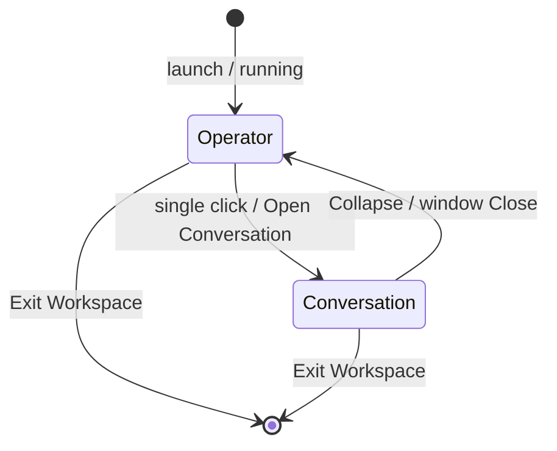

# Execution Program — P5 Native Desktop Operator Refoundation
## Milestone: The Operator Becomes Real

| Field | Value |
| --- | --- |
| **Program** | P5 Native Desktop Operator Refoundation |
| **Date** | 2026-08-07 |
| **Prior** | P4 (`23d9d01`) — superseded interaction model |
| **Authority** | Product Owner review (authoritative) · Product Constitution · Arch Const. V2 |
| **Handoff** | `AWAITING_PROJECT_OWNER_OPERATOR_REFOUNDATION_REVIEW` |

---

## 1. Shell architecture report

Workspace has **exactly two user-facing forms**.

| Form | Name | Window | Role |
| --- | --- | --- | --- |
| **A** | Desktop Operator | `operator` | Idle utility — tiny, movable, always visible, always recoverable |
| **B** | Conversation Window | `main` | Primary product — resizable; close/collapse → Form A |

Legacy Modes 2–3 (Expanded / Specialized shell) are **removed** as shell forms. Product tools (Save, Continue, Guide, Health) open as a **dock inside Conversation**, not as a third runtime form.

Settings surface removed (more surface than value). Hide-to-taskbar removed (operator stays visible).

---

## 2. State transition diagram

Lifecycle law:

`Running → Operator ⇄ Conversation → Exit`

Collapse ≠ Exit. Close Conversation ≠ Exit. Exit ends the process.

---

## 3. Zero-Trap verification

| Rule | Status |
| --- | --- |
| Operator → Conversation | Pass |
| Conversation → Operator (Collapse + Close) | Pass |
| No Expanded / Settings / Hide shell exits | Pass |
| No unreachable form | Pass |
| Automated | `pnpm verify:shell-zero-trap` + `tests/shell-zero-trap.test.ts` |

---

## 4. Windows lifecycle

| Action | Effect |
| --- | --- |
| Launch | Desktop Operator (Form A) |
| Single click operator | Conversation (Form B) |
| Drag operator | Move |
| Collapse / Close conversation | Operator |
| Exit Workspace | Process ends |
| Resize conversation | Persisted across sessions |

---

## 5. Development hygiene

- Release: no console (`windows_subsystem`)
- Debug logs default quiet unless `WORKSPACE_DEV_LOG=1`
- Experience evidence dashboard **opt-in** (developer localStorage) — not auto-mounted for review
- Review launches from a **fresh** `pnpm dev` after validation terminate

---

## 6. Product Owner review checklist

- [ ] Fresh launch shows Desktop Operator (not conversation)
- [ ] Single click → Conversation
- [ ] Collapse → Operator
- [ ] Close (X) → Operator (app still running)
- [ ] Drag moves operator
- [ ] Exit ends Workspace completely
- [ ] No Expand / Settings chrome
- [ ] No terminal / evidence window in default review
- [ ] Ask Save / Continue → tool dock beside conversation (still Form B)

---

## Stop

Await Product Owner approval before any further constitutional execution program.
