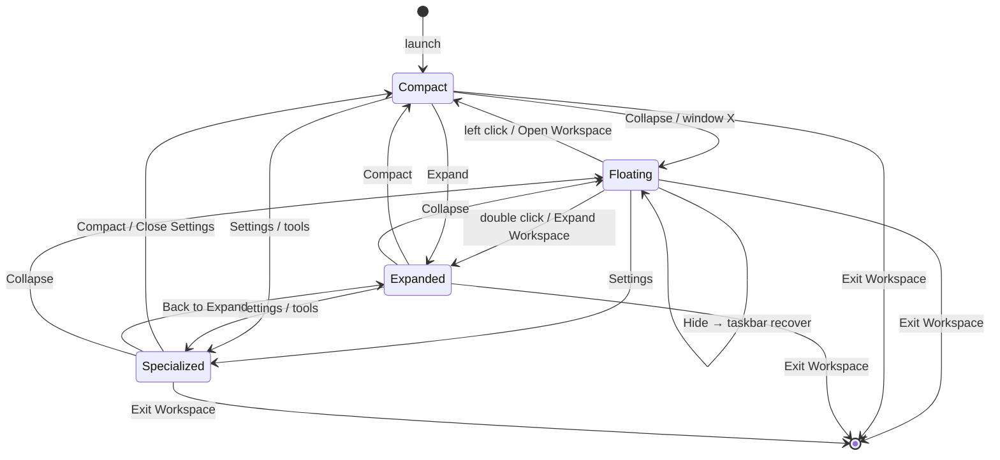

# Execution Program — P4 Native Windows Shell Lifecycle
## Milestone: Desktop Operator Foundation

| Field | Value |
| --- | --- |
| **Program** | P4 Native Windows Shell Lifecycle |
| **Date** | 2026-08-07 |
| **Prior** | P3 Windows Shell Completion (`0a50f19`) |
| **Authority** | Product Constitution · Architectural Constitution V2 · Constitutional Execution Protocol |
| **Handoff** | `AWAITING_PROJECT_OWNER_DESKTOP_OPERATOR_FOUNDATION_REVIEW` |

---

## 1. Shell architecture report

Workspace shell modes are **operating states**, not layouts.

| State | Name | Window | Entry | Exit |
| --- | --- | --- | --- | --- |
| 0 | Floating Desktop Operator | `operator` | Collapse · main X · Hide recover | Left-click → Compact · Double-click → Expand · Menu |
| 1 | Compact Conversation | `main` | Launch default · Open Workspace · Compact | Collapse · Expand · Settings · Exit |
| 2 | Expanded Workspace | `main` | Expand · double-click operator | Compact · Collapse · Settings · Exit |
| 3 | Specialized Surface | `main` | Settings · Product tools · Health (dev) | Compact · Expand · Collapse · Exit |

Durable state (`shellRuntime`): mode, operator/main positions, hidden flag, specialized target (`settings` \| `health` \| `none`).

**Zero development leakage:** release builds use `windows_subsystem = "windows"` (no console). Debug logging defaults to `warn` unless `WORKSPACE_DEV_LOG=1` or explicit `RUST_LOG`.

---

## 2. State transition diagram

---

## 3. Zero-Trap verification report

| Rule | Status |
| --- | --- |
| Every mode has ≥1 obvious exit | Pass (`SHELL_EXITS`) |
| All modes reachable from Compact | Pass (`verifyZeroTrapGraph`) |
| Floating → Compact recovery | Pass |
| Floating → Specialized (Settings) | Pass |
| Main close → Mode 0 (never process death) | Pass (`installMainCloseCollapse`) |
| Hide → taskbar, no Task Manager | Pass |
| Exit only via explicit Exit Workspace | Pass |
| Automated | `pnpm verify:shell-zero-trap` + `tests/shell-zero-trap.test.ts` |

---

## 4. Windows lifecycle report

| Behaviour | Implementation |
| --- | --- |
| Close (main) | Collapse to floating operator |
| Minimize / Hide | Operator minimized; taskbar recovery |
| Restore | Unminimize + show + focus |
| Focus / z-order | Operator always-on-top in Mode 0; main not always-on-top in 1–3 |
| Taskbar | Operator visible in Mode 0 / Hide; main visible in 1–3 |
| Duplicate windows | Single `main` + single `operator` labels |
| Orphan windows | Exit invokes `exit_workspace` (both closed) |

Floating operator interactions:

- **Left click** → Compact (debounced vs double-click)
- **Right click** → Open Workspace · Expand Workspace · Hide · Settings · Exit Workspace
- **Double click** → Expanded Workspace

---

## 5. Conversational foundation (unchanged law)

Conversation remains the front door. Settings is an honest Mode 3 surface (shell recovery + trust pointers + explicit “not here yet”) — not a capability catalogue or fake preferences UI.

---

## 6. Future capability readiness

Shell hosts Modes 0–3 and IntentEnvelope adapters (see `docs/shell/FUTURE_INPUT_ARCHITECTURE.md`). Voice, screenshot, clipboard, file drop, memory, automation remain **not implemented** — architecture ready without redesign.

---

## 7. Product Owner review checklist

- [ ] Fresh launch → Compact Conversation
- [ ] Collapse → floating W; desktop usable
- [ ] Left click W → Compact immediately
- [ ] Double click W → Expanded
- [ ] Right click → Open / Expand / Hide / Settings / Exit
- [ ] Settings → Mode 3; Close → Compact (no dead end)
- [ ] Hide → recover from taskbar
- [ ] Window X on Compact → floating W
- [ ] Expanded ↔ Compact ↔ Floating round-trips
- [ ] Exit Workspace ends process; relaunch clean
- [ ] No terminal / Cargo / Vite leakage in product UX
- [ ] No onboarding dashboard in Compact

---

## Stop

Await Product Owner approval before any further constitutional execution program.
