# Execution Program: P3 Windows Shell Completion

| Field | Value |
| --- | --- |
| **Program** | Windows Shell Completion (Desktop Operator Foundation) |
| **Date** | 2026-08-07 |
| **Handoff** | Awaiting Product Owner review |
| **Scope** | Shell polish only — not AI, not automation, not new desktop powers |

---

## Shell architecture summary

Two Tauri windows:

| Window | Role |
| --- | --- |
| `operator` | Mode 0 floating companion (taskbar-visible for recovery) |
| `main` | Modes 1–3 conversation + optional specialized tools |

Durable state in `localStorage`: mode, operator position, main position, hidden flag.

Close (X) on `main` → **Collapse to Mode 0** (not process death).  
**Exit Workspace** → `exit_workspace` command ends the process.

---

## State transition diagram

```mermaid
stateDiagram-v2
  [*] --> Compact: Launch (default)
  Floating --> Compact: Left click / Open Workspace
  Floating --> Expanded: Double click / Expand Workspace
  Floating --> Floating: Hide (minimize; taskbar recover)
  Floating --> [*]: Exit Workspace
  Compact --> Floating: Collapse / window X
  Compact --> Expanded: Expand
  Compact --> Specialized: Intent (Save/Continue/…)
  Compact --> [*]: Exit
  Expanded --> Compact: Compact
  Expanded --> Floating: Collapse
  Expanded --> Specialized: Intent / Health
  Expanded --> [*]: Exit
  Specialized --> Compact: Compact
  Specialized --> Expanded: Back / Expand
  Specialized --> Floating: Collapse
  Specialized --> [*]: Exit
```

| From → To | Path |
| --- | --- |
| 0 → 1 | Left click / menu Open |
| 0 → 2 | Double click / menu Expand |
| 1 → 0 | Collapse / close window |
| 1 → 2 | Expand |
| 2 → 1 | Compact |
| 2 → 0 | Collapse |
| * → 3 | Specialized intents |
| 3 → 1/2/0 | Compact / Expand / Collapse |
| any → exit | Exit Workspace |

---

## Zero-Trap verification checklist

- [ ] Mode 0: left click opens Compact
- [ ] Mode 0: right-click menu Open / Expand / Hide / Exit
- [ ] Mode 0: Hide → recover from taskbar (not Task Manager)
- [ ] Mode 1: Collapse → floating W; Windows desktop usable
- [ ] Mode 1: window X → floating W (not stuck closed)
- [ ] Mode 2: Compact and Collapse both work
- [ ] Mode 3: Compact / Collapse / Expand recover
- [ ] Exit Workspace ends the app cleanly
- [ ] Relaunch restores prior mode/position without duplicate zombies
- [ ] No onboarding / capability catalogue in Compact

---

## Future inputs

See `docs/shell/FUTURE_INPUT_ARCHITECTURE.md` (design only).
